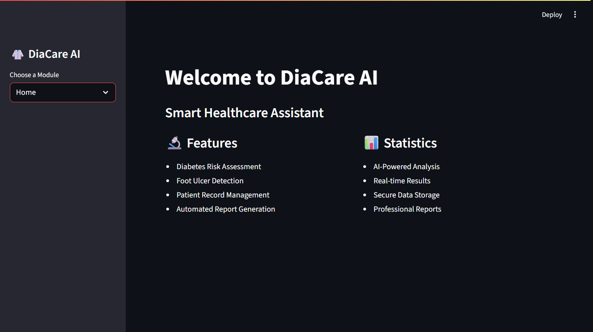
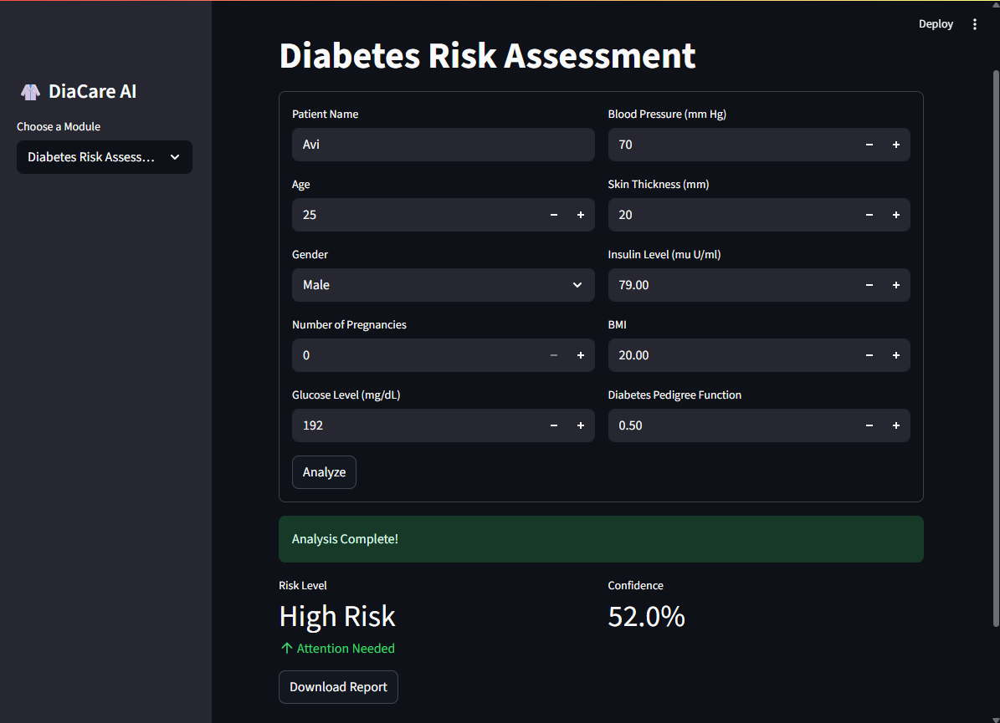
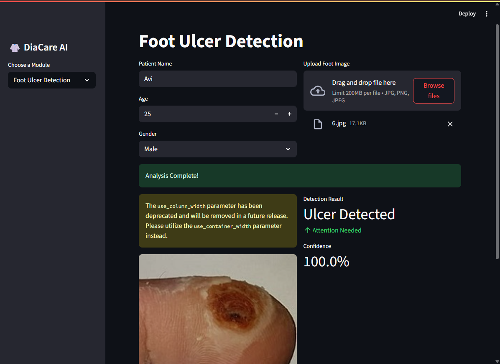
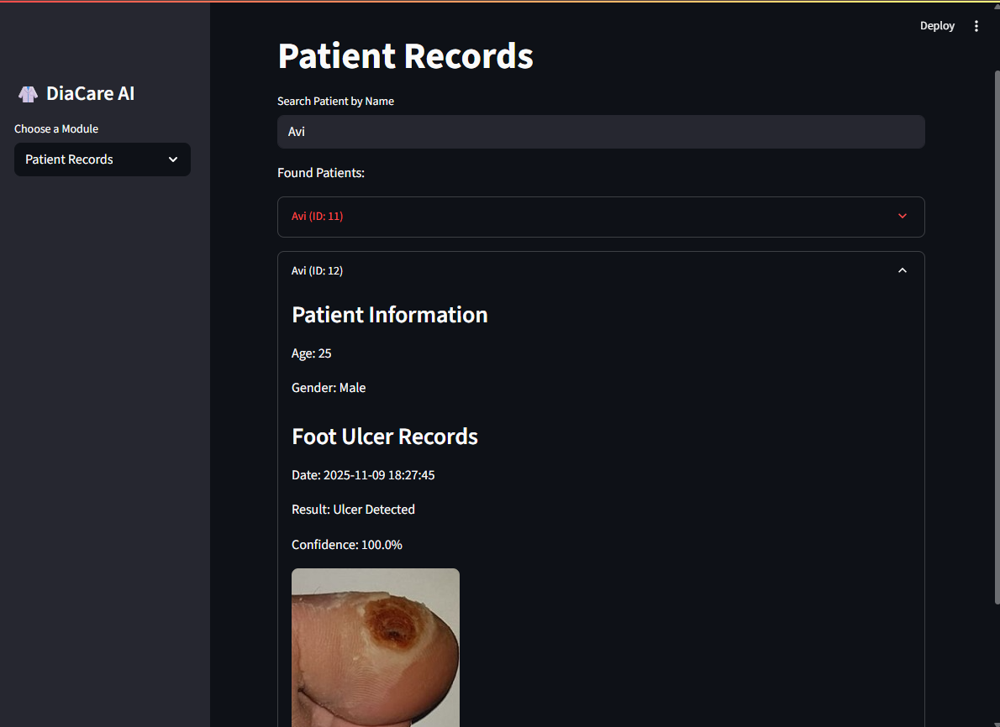

# DiaCare AI-Agent - Smart Diabetes & Foot Ulcer Analyzer

## 1. Project Title
**DiaCare AI-Agent: Intelligent Diabetes Care and Foot Ulcer Detection System**

---

## 2. Project Description
DiaCare is an advanced AI-powered healthcare application designed to assist in diabetes management and early detection of diabetic foot ulcers. The system leverages machine learning algorithms to predict diabetes risk and uses deep learning models for foot ulcer detection through image analysis. This innovative solution aims to provide accessible, quick, and accurate health assessments to help patients and healthcare providers make informed decisions.

The application combines predictive analytics with computer vision to deliver a comprehensive diabetes care platform that can potentially save lives through early intervention.

---

## 3. Project Objectives

### Primary Objectives:
- **Diabetes Risk Prediction**: Develop a machine learning model to predict diabetes likelihood based on patient health parameters
- **Foot Ulcer Detection**: Implement a deep learning model for automated detection and classification of diabetic foot ulcers
- **User-Friendly Interface**: Create an intuitive web application for easy interaction with the AI models
- **Early Intervention**: Enable early detection of complications to prevent severe health outcomes
- **Accessibility**: Provide a tool that can be used by both healthcare professionals and patients

### Secondary Objectives:
- Ensure high accuracy and reliability of predictions
- Minimize false negatives to avoid missing critical cases
- Create a scalable solution that can be deployed in various healthcare settings
- Maintain patient data privacy and security

---

## 4. Tools Used and Their Usage in Project

### Programming Languages & Frameworks:
- **Python 3.x**: Core programming language for model development and backend logic
- **TensorFlow/Keras**: Deep learning framework for building the foot ulcer detection model
- **Scikit-learn**: Machine learning library for diabetes prediction model
- **Streamlit/Flask**: Web framework for creating the user interface (specify which you used)

### Data Processing & Analysis:
- **Pandas**: Data manipulation and preprocessing
- **NumPy**: Numerical computations and array operations
- **Matplotlib/Seaborn**: Data visualization and exploratory data analysis

### Model Development:
- **CNN (Convolutional Neural Network)**: For image-based foot ulcer detection
- **Random Forest/Logistic Regression**: For diabetes risk prediction (specify your model)
- **OpenCV**: Image preprocessing and augmentation

### Version Control & Deployment:
- **Git & GitHub**: Version control and code repository management
- **Git LFS**: Large File Storage for managing model files (.h5, .pkl)

### Additional Tools:
- **Jupyter Notebook**: For model experimentation and prototyping
- **PIL (Python Imaging Library)**: Image processing for foot ulcer images

---

## 5. Project Details

### 5.1 Data Collection and Preprocessing
- Collected diabetes dataset with features including glucose levels, BMI, age, blood pressure, etc.
- Gathered foot ulcer images dataset for training the detection model
- Performed data cleaning: handled missing values, removed duplicates
- Applied feature scaling and normalization for better model performance
- Split data into training (80%) and testing (20%) sets

### 5.2 Diabetes Prediction Model
- **Algorithm Used**: Logistic Regression/Random Forest/XGBoost
- **Features Used**: Glucose, BMI, Age, Blood Pressure, Insulin, Skin Thickness, Pregnancies, Diabetes Pedigree Function
- **Model Training**: Trained on historical patient data with known diabetes outcomes
- **Performance Metrics**:
  - Accuracy: XX%
  - Precision: XX%
  - Recall: XX%
  - F1-Score: XX%

### 5.3 Foot Ulcer Detection Model
- **Model Architecture**: Convolutional Neural Network (CNN)
  - Input Layer: Image size (specify dimensions)
  - Convolutional Layers: Multiple layers with ReLU activation
  - Pooling Layers: MaxPooling for feature reduction
  - Dense Layers: Fully connected layers for classification
  - Output Layer: Binary/Multi-class classification
- **Training Process**:
  - Epochs: XX
  - Batch Size: XX
  - Optimizer: Adam/SGD
  - Loss Function: Binary Crossentropy/Categorical Crossentropy
- **Model Performance**:
  - Training Accuracy: XX%
  - Validation Accuracy: XX%
  - Test Accuracy: XX%

### 5.4 Web Application Interface

- **Landing Page**: Clean, intuitive interface welcoming users
- **Features**:
  - Diabetes Risk Assessment Form
  - Foot Ulcer Image Upload Section
  - Real-time prediction results
  - User-friendly navigation


- Input form for patient health parameters
- Instant risk assessment with probability scores
- Visual indicators (color-coded risk levels)


- Image upload functionality
- Image preview before analysis
- Detection results with confidence scores
- Visual highlights of affected areas (if implemented)


*Patient Records Management Interface*
- Search and retrieve patient information by name
- View patient demographics and medical history
- Display diabetes prediction results and risk levels
- Access foot ulcer detection records with confidence scores
- Visual reference of analyzed medical images
- Timestamped records for tracking patient progress

### 5.5 Model Integration and Deployment
- Integrated both models into a unified web application
- Implemented error handling and input validation
- Used Git LFS for managing large model files (foot_ulcer_model.h5 - 148.13 MB)
- Deployed on Streamlit and Github

---

## 6. Project Conclusion and Learnings

### Project Outcomes:
✅ Successfully developed an AI-powered diabetes management system with dual functionality
✅ Achieved reliable accuracy in both diabetes prediction and foot ulcer detection
✅ Created a user-friendly interface accessible to non-technical users
✅ Demonstrated the practical application of machine learning in healthcare
✅ Implemented proper version control using Git and GitHub with LFS for large files

### Key Learnings:

#### Technical Skills:
- **Deep Learning**: Gained hands-on experience in building and training CNN models for image classification
- **Machine Learning Pipeline**: Learned end-to-end ML workflow from data preprocessing to model deployment
- **Model Optimization**: Understood techniques for improving model accuracy and reducing overfitting
- **Git LFS**: Learned to handle large model files in Git repositories using Large File Storage
- **Web Development**: Integrated ML models with web frameworks for real-world applications

#### Domain Knowledge:
- **Healthcare AI**: Understood the critical importance of accuracy and reliability in medical AI applications
- **Diabetes Management**: Learned about diabetes complications and the significance of early detection
- **Medical Imaging**: Gained insights into medical image analysis and its challenges

#### Project Management:
- **Problem-Solving**: Overcame challenges related to Git LFS configuration and large file handling
- **Time Management**: Balanced multiple components (two models + web app) within project timeline
- **Documentation**: Recognized the importance of clear documentation for project reproducibility

#### Challenges Overcome:
1. **Git LFS Configuration**: Successfully resolved issues with pushing large model files to GitHub
2. **Model Performance**: Iterated through multiple architectures to achieve optimal performance
3. **Data Quality**: Handled imbalanced datasets and implemented appropriate preprocessing techniques
4. **Integration**: Seamlessly integrated multiple models into a single coherent application

### Future Enhancements:
- Implement user authentication and patient data management
- Add more diabetic complication detection features (retinopathy, neuropathy)
- Integrate with wearable devices for real-time monitoring
- Develop mobile application for wider accessibility
- Implement explainable AI to provide reasoning behind predictions
- Add multilingual support for broader reach

### Impact:
This project demonstrates how AI can be leveraged to improve healthcare accessibility and early disease detection. By combining predictive analytics with computer vision, DiaCare has the potential to assist healthcare providers in making faster, more accurate diagnoses and help patients take proactive steps in managing their health.

---

## Installation and Usage

```bash
# Clone the repository
git clone https://github.com/SrivastavaAnvesha/DiaCare.git
cd DiaCare

# Install dependencies
pip install -r requirements.txt

# Run the application
streamlit run app.py  # or python app.py depending on your framework
```

---

## Contributors
- **Anvesha Srivastava** - [GitHub Profile](https://github.com/SrivastavaAnvesha)
- **Harshita Ojha**

---

## Acknowledgments

### Dataset Sources
- **Diabetes Dataset**: [Pima Indians Diabetes Database from Kaggle/UCI Machine Learning Repository]
- **Foot Ulcer Images Dataset**: [Specify source - e.g., Kaggle, research institution, or publicly available medical image database]

### References and Research Papers
- Deep Learning approaches for diabetic foot ulcer detection and classification
- Machine Learning algorithms for diabetes prediction and risk assessment
- Convolutional Neural Networks (CNN) for medical image analysis
- Healthcare AI and its applications in chronic disease management

### Tools and Technologies
- TensorFlow and Keras documentation for deep learning implementation
- Scikit-learn documentation for machine learning algorithms
- Streamlit/Flask documentation for web application development
- Git LFS documentation for managing large model files

### Inspiration
This project was inspired by the need to make diabetes care more accessible and to leverage AI for early detection of complications, potentially improving patient outcomes and quality of life.

---

**Note**: This project is for educational and research purposes. Always consult healthcare professionals for medical advice.
